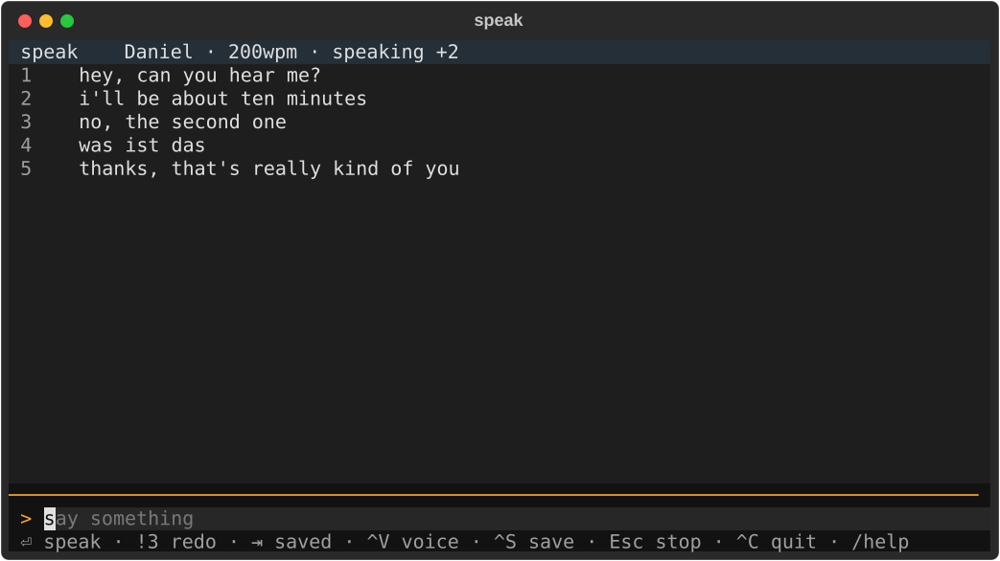
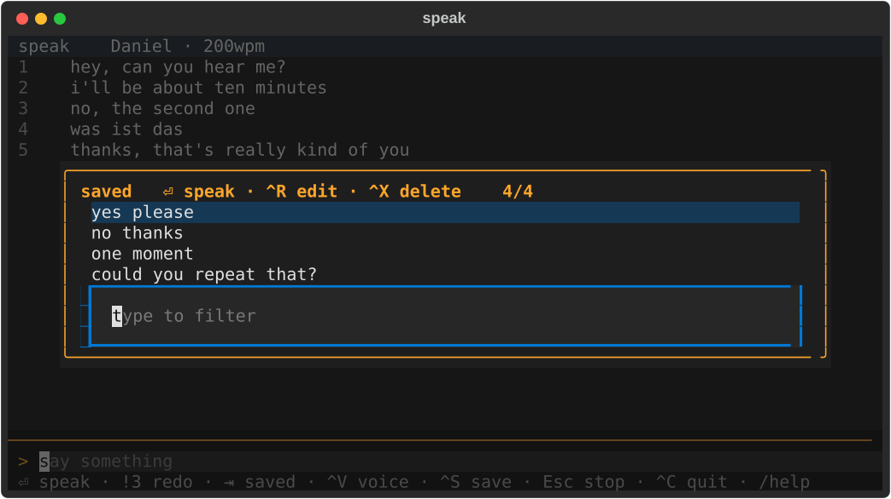
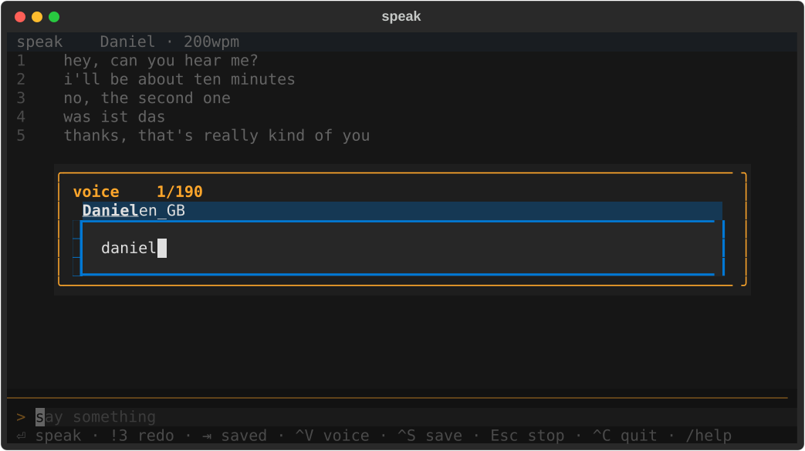

# speak

A full-screen TUI for macOS's built-in `say`. Type a line, press Enter, and
keep typing while it talks — with recallable history and saved phrases.



Lines queue through one worker thread, so you can type ahead and they come out
in order — nothing waits for the speech to finish. Past lines stay on screen
to say again, edit, or save as a phrase.

## Status

Vibe coded by one person, for one person.

## Installing

From PyPI:

```sh
uv tool install speak-tui        # or: pipx install speak-tui
speak
```

The package is `speak-tui`; the command it installs is `speak`.

Working on it instead? See [docs/development.md](docs/development.md).

## What it looks like

`⇥` opens saved phrases. Both pickers filter as you type, on a subsequence
match, with the matched letters underlined:



`^V` picks a voice the same way — 190 of them on this machine, so filtering
matters:



## Keys and commands

Two spellings, one rule:

> A key does something to what you're saying. A `/command` configures the app.

`/help` shows this list in the app, and so does `F1`.

| key | |
|---|---|
| type + `⏎` | speak it — queued, so carry on typing |
| `↑` `↓` | pick a past line, wrapping at both ends |
| `⏎` | say the picked line again |
| `Esc` | cancel — an edit, else the selection, else the talking |
| `!3` | say line 3; `!` alone repeats the last |
| `^R` | edit the picked line, or a saved phrase — saves silently |
| `^X` | delete the picked line |
| `⇥` | saved phrases — type to filter, `^R` edits, `^X` deletes |
| `^V` | voice — type to filter |
| `^S` | save the typed, picked, or last-said line |
| `^C` `^D` `^Q` | quit |
| `\` | speak a literal leading `/` or `!` |
| `F1` | this list — or type `/help` |

| command | |
|---|---|
| `/voice <name>` | set by name; bare `/voice` restores the default |
| `/rate <wpm>` | e.g. `/rate 200`; bare `/rate` restores 175 |
| `/clear` | empty the transcript |
| `/help` | this list |

There is no `/quit`: `^C` does what it does everywhere else and `^D` is EOF.
`^Q` works too — that one is textual's own default, and overriding it to do
nothing would be worse than a third way out.

`Esc` stopping the speech is last in its list on purpose. It is also how you
get back to typing from a picked line, and a navigation key that silently
dropped a queue you had just typed ahead would be a nasty surprise.

State lives in `~/.config/speak/config.json` (voice, rate, saved phrases) and
`~/.local/share/speak/transcript` (the last 500 lines, reloaded at launch).

## Personal Voice

A trained Personal Voice shows up in `say -v ?` like any other voice, so `^V`
lists it and nothing here needs configuring. Apple documents the setup:
[create one](https://support.apple.com/guide/mac-help/mchldfd72333/mac), then
[allow apps to use it](https://support.apple.com/guide/mac-help/mchl4b5f02ec/mac).

One step is easy to miss, because the pane does not mention it: training does
not start on its own. Open the voice's own row and press **Start training…**.
Until you do, it reads "Recording complete" indefinitely.

## Notes

`say` has a few undocumented edges — a wrong voice name exits 0 and silently
substitutes a fallback, 175 wpm is the default, the default voice has no name,
and nothing at all will stress a single word. Measurements in
[docs/discoveries.md](docs/discoveries.md).

## Development

Layout, tests, screenshots and releasing: [docs/development.md](docs/development.md).

## Licence

MIT
